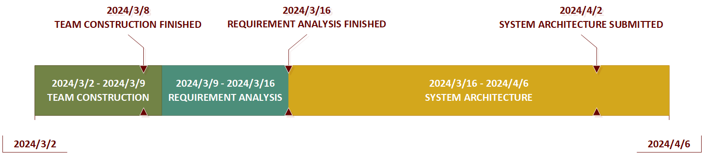

# Calender

This is our calender page for plan and view upcoming events, milestones, and meetings.

## Project Gantt Chart

The Gantt Chart of our Project outlines the start and end dates of the project phases, key milestones, and deadlines, ensuring that everyone has a clear understanding of the project's progress and what is expected.

## 20240330 We finished illustrating the digram for our group!

We finished illustrating the class diagram and component diagram for web application developing! Our work will then be merged with other groups. Check our state of the art by clicking [**here**](./project/system-architecture/diagrams-v1.1/).

## 20240326 We have a meeting with other PMs!

We have a short wehcat meeting with other PMs in which we decided to merge our result by submitting class diagrams from each group. The deadline is 1st, April. Check our schedules [**here**](./CALENDER.md).

## 20240324 We integrated a Gantt chart into our project calendar! 

We integrated a Gantt chart into our project calendar to offer a comprehensive view of our current progress and upcoming tasks. Hopefully it will always be put on the top of [**CALENDER.md**](./CALENDER.md).

## 20240324 We illustrated the system architeture by a few diagrams!

We tried to illustrate the classes needed for web application developing by a class diagram, a component diagram and a deployment diagram. Click [**here**](./project/system-architecture/diagrams-v1.0/) for details.

## 20240320 We illustrated the system architeture by a class diagram! (Not used)

We tried to illustrate the classes needed for web application developing by a class diagram.

## 20240320 We started system architeturing!

We planned to present our system architecture through a series of diagrams and a software design specification document.

## 20240319 We made a few updates to the requirement analysis!

We did a few minor updates about naming and coloring of use cases. Check out the latest version [**here**](./project/requirement-analysis/Software%20Requirements%20Specification%20v1.3.md).

## 20240316 We finished the first version of our requirement analysis!

We're thrilled to announce the completion of the first version of our requirement analysis! This is a significant milestone in our journey to develop a software product for urban explorers. Dive into the details and understand our project's foundation by clicking [**here**](./project/requirement-analysis/Software%20Requirements%20Specification%20v1.2.md)! This document is crucial for guiding our development process and ensuring that we meet the needs of our users effectively.

## 20240313 We finished our role division!

Check out the [**Role Division**](./README.md#%EF%B8%8F-role-division) part in README.md for more details.

## 20240311 Welcome to our new members from UTAD!

We were warmly wlcoming two new members from UTAD, Portugal!🍇

## 20240305 Portuguese members WANTED! (Finished)

Dear potential team members from Portugal,

We are thrilled to invite you to join our team, Dream, Share, Discover, as we embark on a journey not just of innovation and exploration, but of building a home together. Your unique perspectives and skills will not only drive the success of our project but also enrich our team's culture, making every day a shared adventure. As we navigate the challenges of our project, we look forward to creating a space where everyone feels at home, sharing not just tasks but also our daily lives and dreams!

Welcome to our family!

Warmly,

Paul, Frank, Steven, Jason.